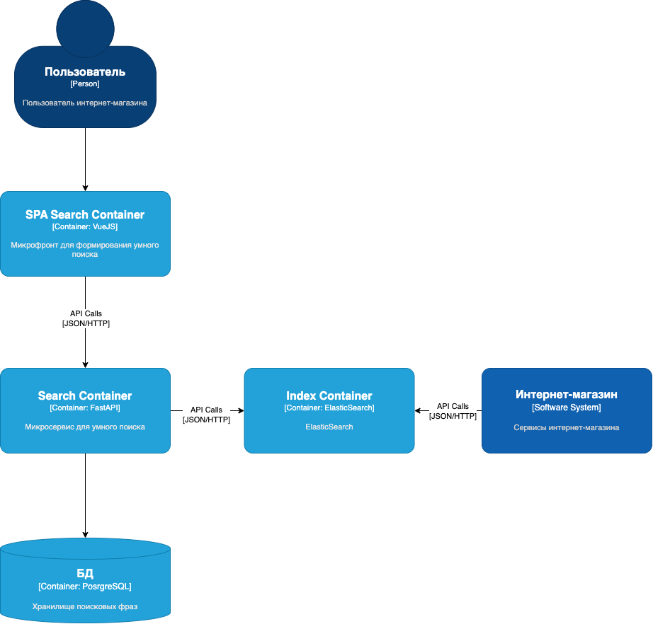
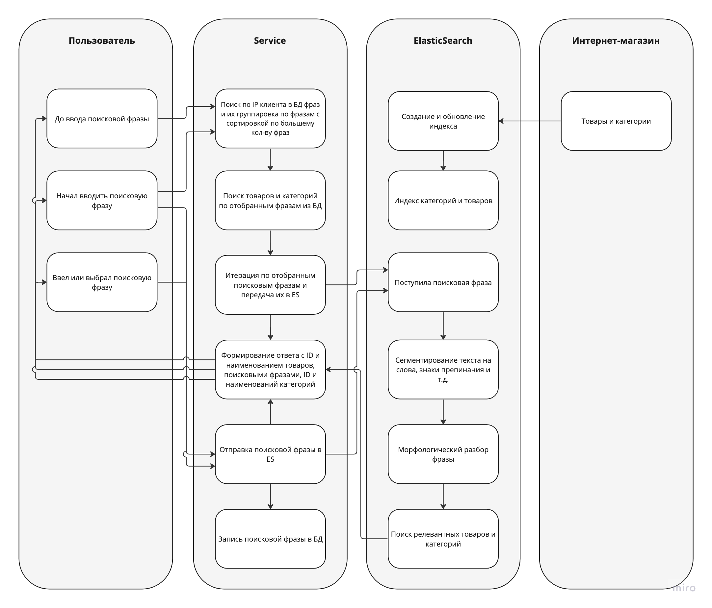

# Тестовое задание

### Задача: Разработать микросервис, реализующий функционал для поисковых персонализированных подсказок

#### C4 нотация

##### Компоненты системы
`Пользователь` - внешний пользователь системы, который вводит поисковую фразу

`Search Container` - микрофронт, который общается только с микросервисом умного поиска 

`Phrases Container` - микросервис, который отвечает за агрегацию всех поисковых фраз и дальнейшую их индексацию

`Index Container` - это отдельно стоящий сервис Elasticsearch, который отвечает за хранение и формирование поисковых индексов

> Elasticsearch может быть размещен как локальная БД в `Phrases Container`, рядом с PostgreSQL, но это менее предпочтительный вариант, поскольку `IndexContainer` отвечает за формирование общего поискового индекса от разных сущностей системы - товары и категории, поисковые фразы. 
Отдельностоящий ElasticSearch уменьшает связность системы и кормирует отдельный контекст `Хранилище поисковых индексов`

`Интернет-магазин` - это система, которая включает в себя все сервисы, на базе которых реализован Интернет-магазин

#### Смеха формирования индекса

1. Персонификация заложена в завязке на IP адрес пользователя
2. При вводе пользователем поисковых фраз происходит поиск подходящих фраз на выбор с учетом того, что данный пользователь искал ранее. Сначала выводятся персональные рекомендации, потом общие рекомендации на снове поисковой фразы.
3. Каждый раз при вводе поисковых фраз происходит обновление индекса в ES и сохранение в локальной БД микросервиса
4. Сущности из ИМ, по которым должен происходить поиск так же индексируются в ES